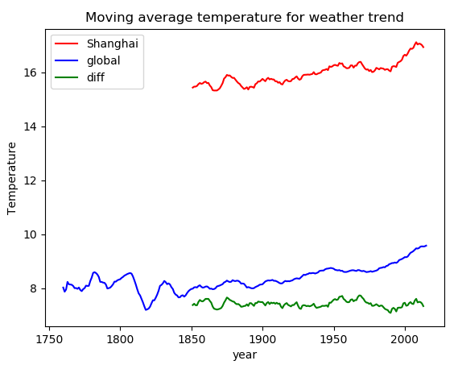

# Weather Trend Analysis 

## 概览
在这个项目中，我们将分析本地和全球的气温数据，并比较居住地的气温走向与全球气温走向。

## 说明
任务：数据可视化，描述全球气温走向和最接近你居住地的大城市气温走向之间的相似性与差异。

### 步骤

1. 用SQL从数据库中 提取数据，并导出csv
2. 创建一个线条图，将你所在城市的气温与全球气温比较。确保绘制 移动平均值 而不是年平均值，使线条平滑，使气温走向便于观察。
3. 观察 世界平均气温与你所在城市平均气温之间的相似性和差异，以及整体趋势，提出问题？

## 提交项目
应提交 PDF 格式的文件，其中包括：

准备在图表中可视化数据而采取的大致步骤，例如：

在每个步骤中，你都使用了哪些工具？（Python、SQL、Excel 等）

请在报告中附上你所有用到的SQL语句或Python代码。
你是如何计算移动平均数的？
在决定如何可视化气温走向时，你的主要考虑因素是什么？
表示本地和全球气温走向的折线图
关于气温走向的相似性和/或差异方面，至少需要提供 四个问题和观察结论

## 结论

下图是上海与全球气温趋势对比图，温度数据为移动平均值数据，按每10年数据计算，若按5年计算其变化波动较大，趋势不明显。



1. 与全球平均气温相比，你所在城市平均气温是比较热还是比较冷？

   上海气温在16℃左右变化， 全球气温主要在9℃左右变化。显然上海平均气温相对较热。

2. 上海和全球长期气温差异是否一致？

   图中绿色diff线条表示两者气温的差异，主要集中在7℃左右，且变化波动小。说明两者长期气温差异一直。

3. 上海气温的整体变化趋势？

   上海地区的整体变化趋势是缓步上升状态，在过去160多年里，气温越来越高。

4. 世界气温的整体变化趋势？

   全球气温变化趋势与上海地区变化趋势类似，也是逐步上升，说明世界正变得越来越热。

## 附录

1. SQL提取数据代码

```sql
-- select shanghai data
SELECT *
FROM city_data
WHERE country = 'China' AND city = 'Shanghai'
ORDER BY year;

-- select global data
SELECT *
FROM global_data
ORDER BY year;
```


1. python实现温度分析。

```python
import numpy as np
import pandas as pd
import matplotlib.pyplot as plt


def computeMovingAverage(data, step):
    '''
    @description: 计算移动平均值
    @param {type} data- 输入数据, step- 单次计算移动平均值的数目
    @return: res- 移动平均值结果
    '''
    res = np.array([])
    for i in range(step, len(data)):
        res = np.append(res, np.average(data[i-step:i]))
    return res


# read data
fname_weather_global = 'data/weather_global.csv'
fname_weather_shanghai = 'data/weather_shanghai.csv'

weather_global = pd.read_csv(fname_weather_global)
weather_shanghai = pd.read_csv(fname_weather_shanghai)

# compute moving average of temperature
step = 10
weather_shanghai_avg = computeMovingAverage(weather_shanghai.avg_temp, step)
weather_global_avg = computeMovingAverage(weather_global.avg_temp, step)
diff_avg = weather_shanghai_avg - \
    weather_global_avg[-len(weather_shanghai_avg):]

# plot
plt.title("Moving average temperature for weather trend")
plt.xlabel("year")
plt.ylabel("Temperature")
plt.plot(weather_shanghai.year[step:], weather_shanghai_avg, color='red')
plt.plot(weather_global.year[step:], weather_global_avg, color='blue')
plt.plot(weather_shanghai.year[step:], diff_avg, color='green')
plt.legend(['Shanghai', 'global', 'diff'])
plt.savefig('plots/weather_trend.png')
plt.show()
```

